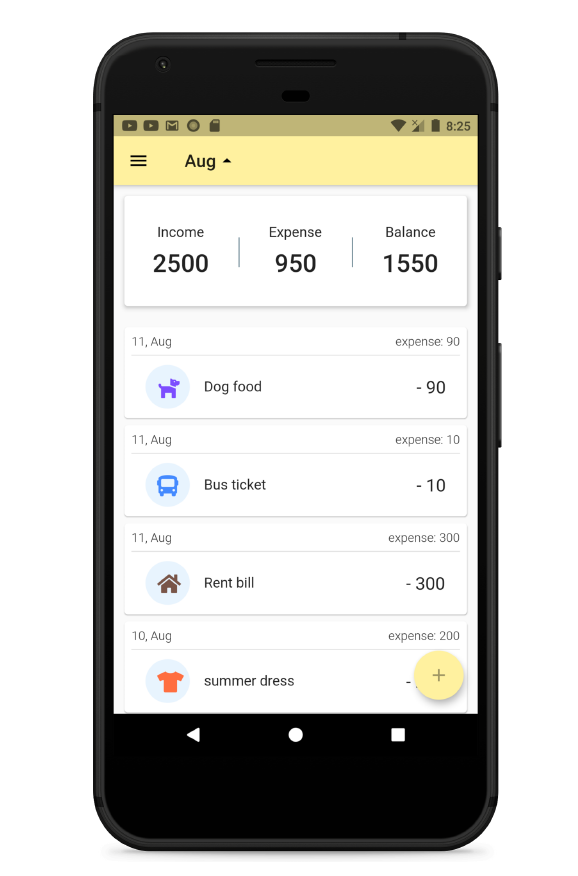
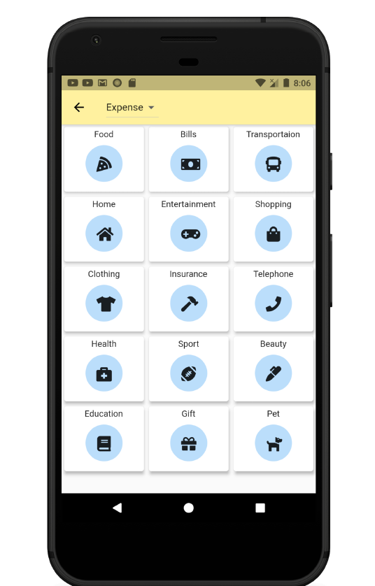
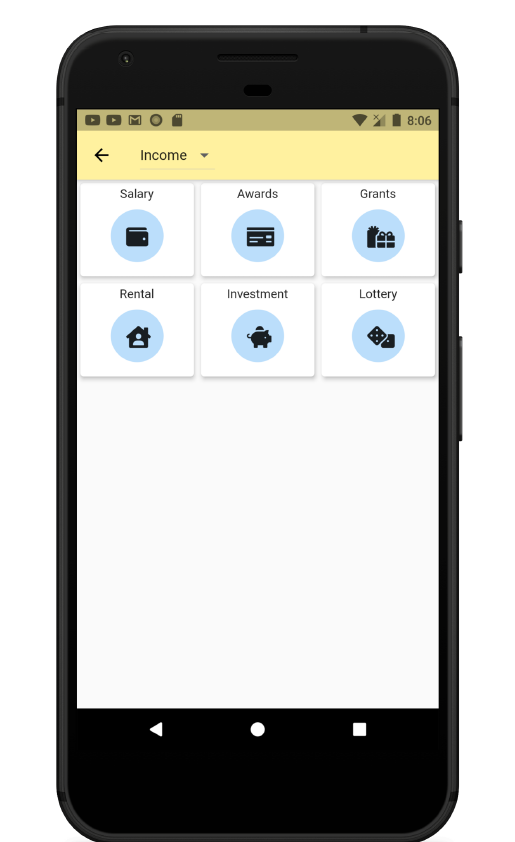
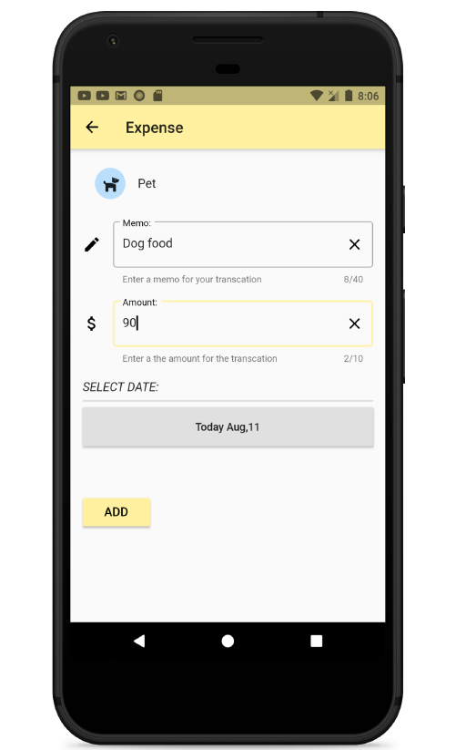
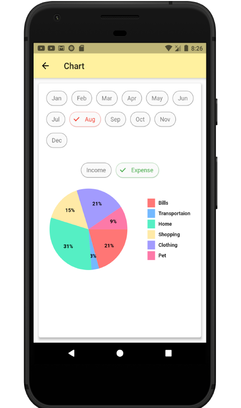
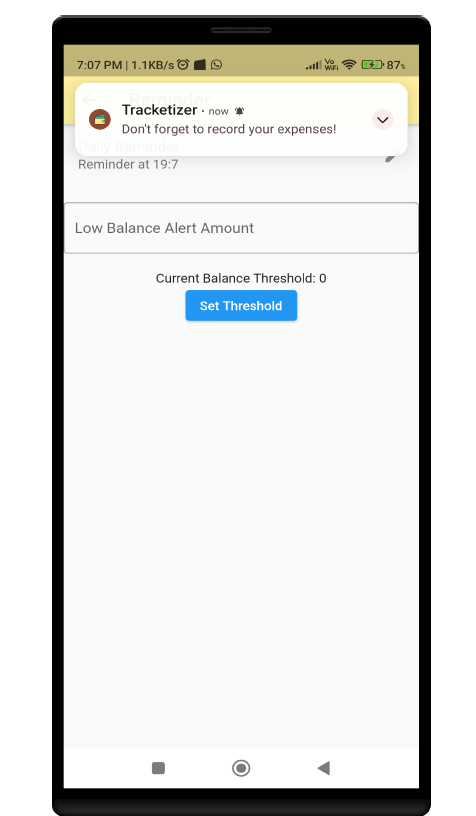

#SpendWise - Personal Finance Manager

📌 Overview

SpendWise is a personal finance management application developed using Flutter. It helps users track their daily expenses, set budgets, and analyze spending habits through intuitive visual representations. Designed to simplify financial management, SpendWise ensures a seamless experience across both Android and iOS platforms.

🚀 Problem Statement

In today's digital world, managing personal finances efficiently is a major challenge. Traditional expense tracking methods such as manual bookkeeping or spreadsheets are prone to errors and lack real-time insights. Many individuals struggle with unorganized spending, manual tracking errors, and difficulty in categorizing expenses. SpendWise addresses these issues by providing an automated and intuitive financial management solution.

🎯 Scope of the Project

SpendWise is designed for:

Individuals who want to track their expenses in real-time.

Users looking for budget management tools.

People who prefer a simple yet effective finance tracker without overwhelming features.

Those who value data privacy and offline access.

✨ Features

✅ Cross-Platform Support - Built using Flutter for a seamless experience on Android and iOS.
✅ User-Friendly Interface - Simple and intuitive design for easy expense tracking.
✅ Real-Time Expense Tracking - Log expenses instantly and categorize them.
✅ Custom Expense Categories - Predefined and user-created categories for flexible tracking.
✅ Budget Management - Set spending limits for different categories with alerts.
✅ Visual Data Representation - Pie charts and bar graphs to analyze spending habits.
✅ Daily Reminders - Notification system to encourage consistent tracking.
✅ Local Data Storage - Uses SQLite (MOOR) for secure, offline data storage.
✅ Dark Mode Support - Enhanced user experience with dark theme.

🏗️ Tech Stack

Frontend: Flutter (Dart)

Database: MOOR (SQLite)

State Management: BLoC Pattern

UI/UX: Material Design

📸 Screenshots

<table>
    <tr>
        <td></td>
        <td></td>
    </tr>
    <tr>
        <td></td>
         <td></td>
    </tr>
    <tr>
        <td></td>
         <td></td>
    </tr>
</table>
